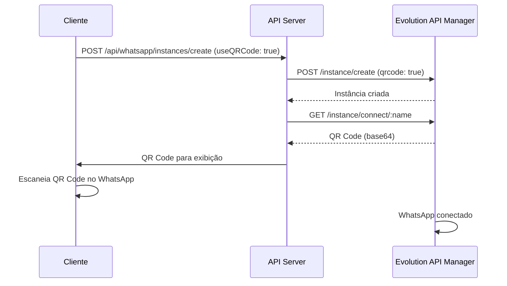
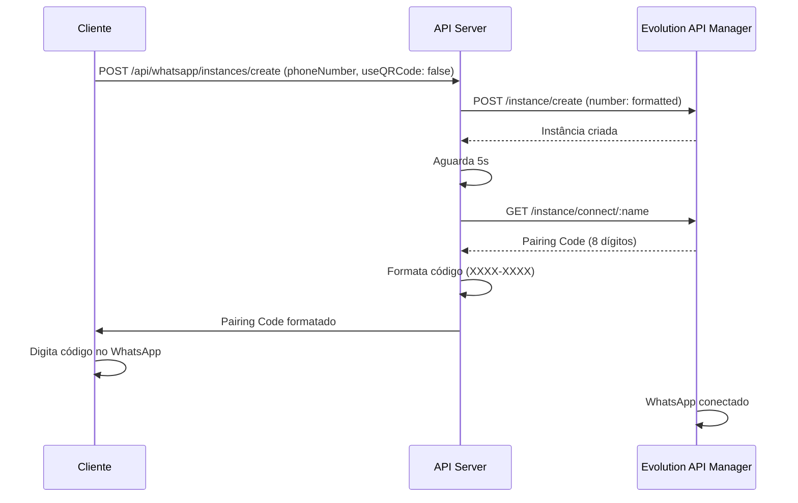

# Integração com Evolution API Manager

## Visão Geral

Esta documentação descreve a integração do sistema de QR Code Restaurante com o **Evolution API Manager** para envio de mensagens WhatsApp. A integração permite que restaurantes conectem suas contas WhatsApp ao sistema e enviem campanhas de marketing personalizadas automaticamente.

## Arquitetura

A integração é composta pelos seguintes componentes principais:

### 1. WhatsAppInstanceManager (`server/whatsapp-instance.ts`)

Classe principal responsável por gerenciar todas as interações com a Evolution API. Implementa os seguintes métodos:

- **Autenticação**: Login no Manager API via email/password ou API Key
- **Criação de Instâncias**: Criação de novas instâncias WhatsApp
- **Obtenção de Códigos**: QR Code ou Pairing Code para conexão
- **Gerenciamento de Status**: Verificação do estado das conexões
- **Envio de Mensagens**: Texto e mídia via API

### 2. Rotas da API (`server/routes.ts`)

Endpoints REST que expõem as funcionalidades do WhatsApp:

- `POST /api/whatsapp/instances/create` - Criar nova instância
- `GET /api/whatsapp/instances/:instanceName/connect` - Obter código de conexão
- `POST /api/whatsapp/instances/connect-pairing` - Conectar via Pairing Code

### 3. Hook React (`client/src/hooks/use-whatsapp-connection.ts`)

Hook customizado que gerencia o estado da conexão no frontend, incluindo:
- Estado da conexão (disconnected, generating, waiting, connected)
- Polling para verificar status
- Gerenciamento de QR Code e Pairing Code

## Configuração

### Variáveis de Ambiente

Configure as seguintes variáveis no `docker-compose.yml`:

```yaml
# WhatsApp / Evolution API
EVOLUTION_API_URL: https://manager.reffix.com.br/api
MANAGER_EMAIL: contato.reffix@gmail.com
MANAGER_PASSWORD: ManagerCriadocompuc0
EVOLUTION_API_GLOBAL_KEY: "15c88ebc2e37f86d00e9ddeed"
```

### Explicação das Variáveis

- **EVOLUTION_API_URL**: URL base do Manager API da Evolution
- **MANAGER_EMAIL**: Email para autenticação no Manager
- **MANAGER_PASSWORD**: Senha para autenticação no Manager
- **EVOLUTION_API_GLOBAL_KEY**: API Key global para requisições diretas à API (alternativa ao login)

## Fluxos Principais

### 1. Criação de Instância via QR Code



### 2. Criação de Instância via Pairing Code



### 3. Autenticação no Manager

O sistema utiliza duas estratégias de autenticação (em ordem de prioridade):

1. **API Key** (se configurada via `EVOLUTION_API_KEY`)
2. **Login via Email/Password** (via `MANAGER_EMAIL` e `MANAGER_PASSWORD`)

O método de autenticação é determinado dinamicamente pela classe `WhatsAppInstanceManager`.

#### Endpoints de Login Testados

O sistema tenta múltiplos endpoints para garantir compatibilidade:

- `{managerUrl}/auth/login`
- `{managerUrl}/api/auth/login`
- `{managerUrl}/api/v1/auth/login`
- `{managerUrl}/manager/auth/login`
- `{managerUrl}/public/auth/login`

## Métodos Principais

### WhatsAppInstanceManager

#### `createInstance(payload: CreateInstancePayload)`

Cria uma nova instância WhatsApp no Manager.

**Parâmetros:**
```typescript
{
  instanceName: string;
  qrcode?: boolean;
  number?: string;
  integration?: string;
}
```

**Exemplo:**
```typescript
await WhatsAppInstanceManager.createInstance({
  instanceName: "restaurante-123",
  qrcode: true,
  integration: "WHATSAPP-BAILEYS"
});
```

#### `getConnectionCode(instanceName: string)`

Obtém QR Code ou Pairing Code para conexão.

**Retorno:**
```typescript
{
  qrcode?: string;      // Data URL do QR Code (data:image/png;base64,...)
  pairingCode?: string; // Código de 8 dígitos formatado
}
```

#### `connectWithPairingCode(instanceName: string, phoneNumber: string)`

Cria instância e obtém Pairing Code em um único método.

**Validação de Telefone:**
- Remove caracteres não numéricos
- Adiciona código do país (55) se necessário
- Formata para padrão brasileiro (DDD + número)

#### `getConnectionState(instanceName: string)`

Verifica o status atual da conexão da instância.

**Possíveis Status:**
- `open` / `connected` - Conectado
- `close` / `disconnected` - Desconectado
- `connecting` - Conectando

#### `validateBrazilianPhone(phone: string)`

Valida e formata números de telefone brasileiros.

**Formato Aceito:**
- 10 dígitos: `11999999999` → `5511999999999`
- 11 dígitos: `11999999999` → `55119999999999`
- 13 dígitos com 55: `5511999999999` (mantém como está)

## Validações e Tratamento de Erros

### Validação de Número Brasileiro

O sistema valida números de telefone brasileiros seguindo estas regras:

1. Remove todos os caracteres não numéricos
2. Verifica se o número tem 10, 11 ou 13 dígitos
3. Adiciona código do país (55) se necessário
4. Garante formato final: `55` + `DDD` + `Número`

### Tratamento de Conflitos

Ao criar uma instância, o sistema verifica:

1. Se já existe instância no banco de dados
2. Se a instância ainda existe na Evolution API
3. Se não existir na API, remove do banco e permite criar nova
4. Se der erro 409 (Conflict), tenta deletar e recriar

### Fallback de Endpoints

O sistema tenta múltiplos endpoints para cada operação:

**Criação:**
- `/instance/create`
- `/instances/create`
- `/api/instance/create`

**Conexão:**
- `/instance/connect/:name`
- `/instances/connect/:name`

**Status:**
- `/instance/fetchInstances/:name`
- `/instances/:name`
- `/instances/status/:name`
- Listagem completa e busca por nome

## Persistência de Dados

### Estrutura no Banco de Dados

As instâncias são salvas na tabela `whatsapp_instances`:

```typescript
{
  id: string;
  restaurantId: string;
  instanceName: string;
  phoneNumber: string | null;
  status: 'created' | 'connected' | 'disconnected';
  integration: 'WHATSAPP-BAILEYS';
  createdAt: Date;
  updatedAt: Date;
}
```

### Nome da Instância

O nome da instância é gerado a partir do nome do restaurante:

```typescript
function resolveRestaurantInstanceName(restaurant: Restaurant): string {
  return restaurant.name
    .toLowerCase()
    .normalize('NFD')
    .replace(/[\u0300-\u036f]/g, '')
    .replace(/[^a-z0-9]/g, '-')
    .replace(/-+/g, '-')
    .replace(/^-|-$/g, '');
}
```

## Envio de Mensagens

### Via Manager API

```typescript
await WhatsAppInstanceManager.sendMessage(
  instanceName,
  phoneNumber,
  message
);
```

### Via API Global (com API Key)

```typescript
await WhatsAppInstanceManager.sendMessageWithGlobalApi(
  instanceName,
  phoneNumber,
  message
);
```

### Envio de Mídia

```typescript
await WhatsAppInstanceManager.sendMediaWithGlobalApi(
  instanceName,
  phoneNumber,
  {
    media?: string;        // Base64 da mídia
    mediaUrl?: string;     // URL da mídia
    mimetype: string;      // Tipo MIME
    caption?: string;      // Legenda
    mediatype: 'image' | 'video' | 'audio' | 'document';
  }
);
```

## Segurança

### Autenticação

- Tokens JWT são obtidos via login e reutilizados nas requisições
- Tokens são incluídos no header `Authorization: Bearer {token}`
- API Keys alternativas podem ser usadas via header `apikey`

### Validação de Permissões

Todas as rotas protegidas verificam:
1. Sessão válida (`requireAuth` middleware)
2. `restaurantId` na sessão
3. Instância pertence ao restaurante autenticado

## Logging e Debug

O sistema inclui logs detalhados para facilitar o debug:

```typescript
// Configuração
WhatsAppInstanceManager.logConfiguration();

// Logs automáticos em:
// - Tentativas de autenticação
// - Criação de instâncias
// - Obtenção de códigos
// - Verificação de status
// - Erros e fallbacks
```

## Troubleshooting

### Erro: "Credenciais do Manager API não configuradas"

**Solução:** Verifique se `MANAGER_EMAIL` e `MANAGER_PASSWORD` estão configurados no `docker-compose.yml`.

### Erro: "Não foi possível criar a instância"

**Soluções:**
1. Verifique se a Evolution API está acessível
2. Confirme as credenciais de autenticação
3. Verifique logs para ver qual endpoint falhou

### QR Code não aparece

**Soluções:**
1. Aguarde alguns segundos após criar a instância
2. Verifique se o endpoint `/instance/connect/:name` está retornando dados
3. Confira logs para ver se o QR Code foi obtido mas não formatado corretamente

### Pairing Code inválido

**Soluções:**
1. Verifique se o número foi formatado corretamente (55 + DDD + número)
2. Confirme que o número tem 12 ou 13 dígitos
3. Verifique se a instância foi criada com sucesso antes de solicitar o código

## Próximos Passos

### Melhorias Sugeridas

1. **Webhook de Status**: Implementar webhooks para notificações em tempo real
2. **Retry Automático**: Adicionar retry automático em caso de falhas temporárias
3. **Cache de Tokens**: Implementar cache de tokens para reduzir chamadas de autenticação
4. **Métricas**: Adicionar métricas de uso e performance

## Referências

- [Evolution API Documentation](https://doc.evolution-api.com/)
- [Baileys WhatsApp Library](https://github.com/WhiskeySockets/Baileys)

---

**Última atualização:** Janeiro 2025
**Versão da Integração:** 1.0.0

